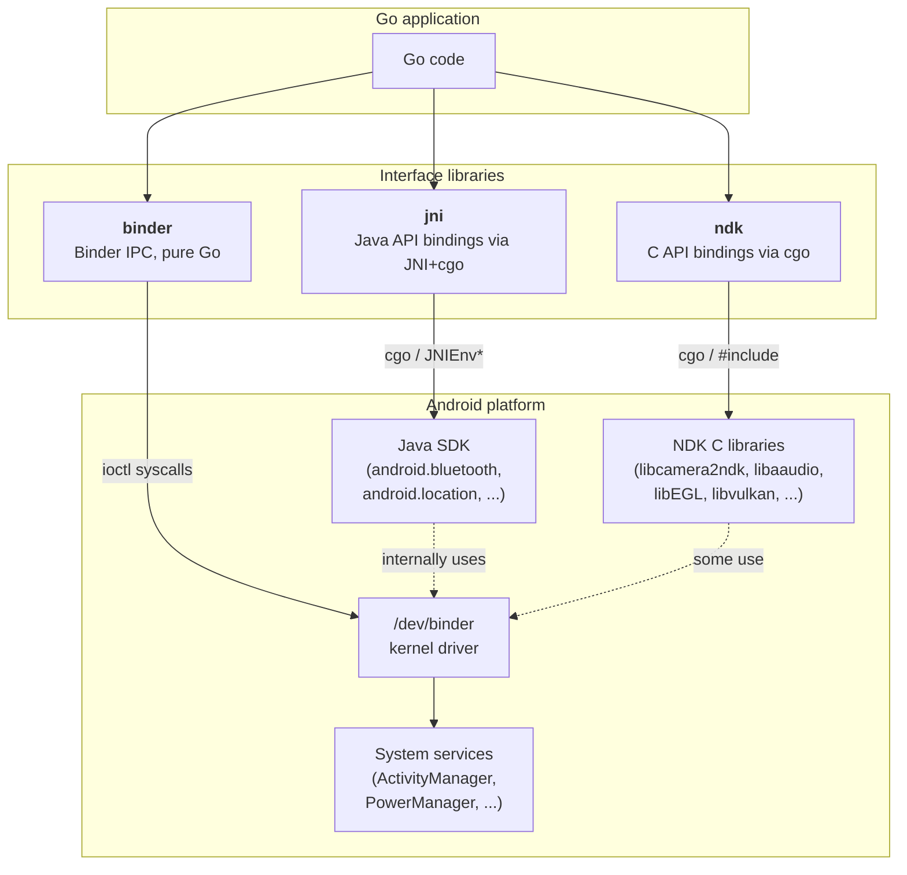
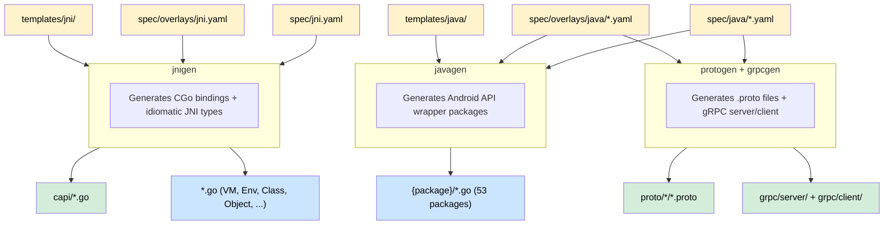
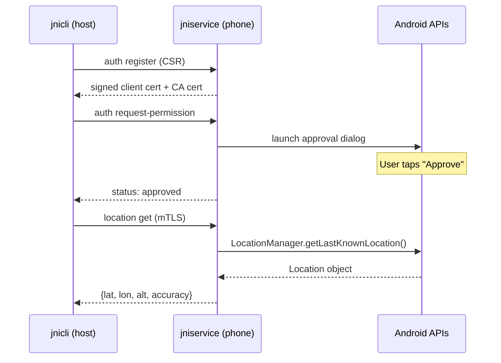
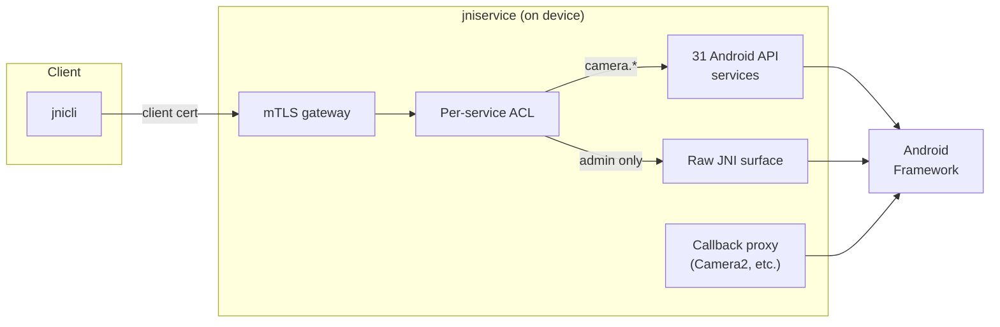

# jni

[](https://pkg.go.dev/github.com/xaionaro-go/jni)
[](https://goreportcard.com/report/github.com/xaionaro-go/jni)
[](LICENSE)
[](go.mod)

Idiomatic Go bindings for the Java Native Interface and 53 Android Java API packages, auto-generated from YAML specs to ensure full coverage and easy maintenance. Includes a gRPC layer for remote Android API access.

## Android Interfaces for Go

This project is part of a family of three Go libraries that cover the major Android interface surfaces. Each wraps a different layer of the Android platform:



| Library | Interface | Requires | Best for |
|---|---|---|---|
| **[ndk](https://github.com/xaionaro-go/ndk)** | Android NDK C APIs | cgo + NDK toolchain | High-performance hardware access: camera, audio, sensors, OpenGL/Vulkan, media codecs |
| **[jni](https://github.com/xaionaro-go/jni)** (this project) | Java Android SDK via JNI | cgo + JNI + JVM/ART | Java-only APIs with no NDK equivalent: Bluetooth, WiFi, NFC, location, telephony, content providers |
| **[binder](https://github.com/xaionaro-go/binder)** | Binder IPC (system services) | pure Go (no cgo) | Direct system service calls without Java: works on non-Android Linux with binder, minimal footprint |

### When to use which

- **Start with ndk** when the NDK provides a C API for what you need (camera, audio, sensors, EGL/Vulkan, media codecs). These are the lowest-latency, lowest-overhead bindings since they go straight from Go to the C library via cgo.

- **Use jni** when you need a Java Android SDK API that the NDK does not expose. Examples: Bluetooth discovery, WiFi P2P, NFC tag reading, location services, telephony, content providers, notifications. JNI is also the right choice when you need to interact with Java components (Activities, Services, BroadcastReceivers) or when you need the gRPC remote-access layer.

- **Use binder** when you want pure-Go access to Android system services without any cgo dependency. This is ideal for lightweight tools, CLI programs, or scenarios where you want to talk to the binder driver from a non-Android Linux system. AIDL covers the same system services that Java SDK wraps (ActivityManager, PowerManager, etc.) but at the wire-protocol level.

- **Combine them** when your application needs multiple layers. For example, a streaming app might use **ndk** for camera capture and audio encoding, **jni** for Bluetooth controller discovery, and **binder** for querying battery status from a companion daemon.

### How they relate to each other

All three libraries talk to the same Android system services, but through different paths:

- The **NDK C APIs** are provided by Google as stable C interfaces to Android platform features. Some (camera, sensors, audio) internally use binder IPC to talk to system services; others (EGL, Vulkan, OpenGL) talk directly to kernel drivers. The `ndk` library wraps these C APIs via cgo.
- The **Java SDK** uses binder IPC internally for system service access (BluetoothManager, LocationManager, etc.), routing calls through the Android Runtime (ART/Dalvik). The `jni` library calls into these Java APIs via the JNI C interface and cgo.
- The **AIDL binder protocol** is the underlying IPC mechanism that system-facing NDK and Java SDK APIs use. The `binder` library implements this protocol directly in pure Go, bypassing both C and Java layers entirely.

## Usage Examples

### Bluetooth Discovery

```go
import (
    "github.com/xaionaro-go/jni"
    "github.com/xaionaro-go/jni/app"
    "github.com/xaionaro-go/jni/bluetooth"
)

    ctx, _ := app.NewContext(vm)
    adapter, _ := bluetooth.NewAdapter(ctx)
    defer adapter.Close()

    fmt.Println("Enabled:", adapter.IsEnabled())
    fmt.Println("Name:", adapter.GetName())

    devices, _ := adapter.GetBondedDevices()
    for _, d := range devices {
        fmt.Printf("  %s (%s)\n", d.Name, d.Address)
    }
```

### Location

```go
import (
    "github.com/xaionaro-go/jni/app"
    "github.com/xaionaro-go/jni/location"
)

    ctx, _ := app.NewContext(vm)
    mgr, _ := location.NewManager(ctx)
    defer mgr.Close()

    loc, _ := mgr.GetLastKnownLocation(location.GpsProvider)
    if loc != nil {
        fmt.Printf("lat=%.6f lon=%.6f\n", loc.Latitude, loc.Longitude)
    }
```

### WiFi

```go
import "github.com/xaionaro-go/jni/net/wifi"

    mgr, _ := wifi.NewManager(ctx)
    defer mgr.Close()

    fmt.Println("WiFi enabled:", mgr.IsEnabled())
    info, _ := mgr.GetConnectionInfo()
    fmt.Println("SSID:", info.SSID)
```

### Toast

```go
import "github.com/xaionaro-go/jni/widget/toast"

    toast.Show(ctx, "Hello from Go!", toast.LengthShort)
```

More examples: [`examples/`](examples/)

## Supported Packages

53 Android API packages organized in a Java SDK-mirroring hierarchy:

| Android API                                                                                                                                                                    | Go Package       | Import Path                                            |
| ------------------------------------------------------------------------------------------------------------------------------------------------------------------------------ | ---------------- | ------------------------------------------------------ |
| **Application Framework**                                                                                                                                                      |                  |                                                        |
| [](https://pkg.go.dev/github.com/xaionaro-go/jni/app)                                                 | `app`            | `github.com/xaionaro-go/jni/app`                       |
| [](https://pkg.go.dev/github.com/xaionaro-go/jni/app/alarm)                                                    | `alarm`          | `github.com/xaionaro-go/jni/app/alarm`                 |
| [](https://pkg.go.dev/github.com/xaionaro-go/jni/app/download)                                        | `download`       | `github.com/xaionaro-go/jni/app/download`              |
| [](https://pkg.go.dev/github.com/xaionaro-go/jni/app/job)                                                          | `job`            | `github.com/xaionaro-go/jni/app/job`                   |
| [](https://pkg.go.dev/github.com/xaionaro-go/jni/app/notification)                         | `notification`   | `github.com/xaionaro-go/jni/app/notification`          |
| [](https://pkg.go.dev/github.com/xaionaro-go/jni/app/usage)                                               | `usage`          | `github.com/xaionaro-go/jni/app/usage`                 |
| [](https://pkg.go.dev/github.com/xaionaro-go/jni/accounts)                                             | `accounts`       | `github.com/xaionaro-go/jni/accounts`                  |
| **Bluetooth**                                                                                                                                                                  |                  |                                                        |
| [](https://pkg.go.dev/github.com/xaionaro-go/jni/bluetooth)                             | `bluetooth`      | `github.com/xaionaro-go/jni/bluetooth`                 |
| **Content & Storage**                                                                                                                                                          |                  |                                                        |
| [](https://pkg.go.dev/github.com/xaionaro-go/jni/content/clipboard)                                | `clipboard`      | `github.com/xaionaro-go/jni/content/clipboard`         |
| [](https://pkg.go.dev/github.com/xaionaro-go/jni/content/pm)                                                       | `pm`             | `github.com/xaionaro-go/jni/content/pm`                |
| [](https://pkg.go.dev/github.com/xaionaro-go/jni/content/preferences)                         | `preferences`    | `github.com/xaionaro-go/jni/content/preferences`       |
| [](https://pkg.go.dev/github.com/xaionaro-go/jni/content/resolver)                                    | `resolver`       | `github.com/xaionaro-go/jni/content/resolver`          |
| [](https://pkg.go.dev/github.com/xaionaro-go/jni/content/permission)                           | `permission`     | `github.com/xaionaro-go/jni/content/permission`        |
| **Graphics**                                                                                                                                                                   |                  |                                                        |
| [](https://pkg.go.dev/github.com/xaionaro-go/jni/graphics/pdf)                                                      | `pdf`            | `github.com/xaionaro-go/jni/graphics/pdf`              |
| **Hardware**                                                                                                                                                                   |                  |                                                        |
| [](https://pkg.go.dev/github.com/xaionaro-go/jni/hardware/biometric)                                | `biometric`      | `github.com/xaionaro-go/jni/hardware/biometric`        |
| [](https://pkg.go.dev/github.com/xaionaro-go/jni/hardware/camera)                                           | `camera`         | `github.com/xaionaro-go/jni/hardware/camera`           |
| [](https://pkg.go.dev/github.com/xaionaro-go/jni/hardware/ir)                                                   | `ir`             | `github.com/xaionaro-go/jni/hardware/ir`               |
| [](https://pkg.go.dev/github.com/xaionaro-go/jni/hardware/lights)                                           | `lights`         | `github.com/xaionaro-go/jni/hardware/lights`           |
| [](https://pkg.go.dev/github.com/xaionaro-go/jni/hardware/usb)                                                       | `usb`            | `github.com/xaionaro-go/jni/hardware/usb`              |
| **Health**                                                                                                                                                                     |                  |                                                        |
| [](https://pkg.go.dev/github.com/xaionaro-go/jni/health/connect)                                          | `connect`        | `github.com/xaionaro-go/jni/health/connect`            |
| **Location**                                                                                                                                                                   |                  |                                                        |
| [](https://pkg.go.dev/github.com/xaionaro-go/jni/location)                                            | `location`       | `github.com/xaionaro-go/jni/location`                  |
| **Media**                                                                                                                                                                      |                  |                                                        |
| [](https://pkg.go.dev/github.com/xaionaro-go/jni/media/audiomanager)                              | `audiomanager`   | `github.com/xaionaro-go/jni/media/audiomanager`        |
| [](https://pkg.go.dev/github.com/xaionaro-go/jni/media/player)                                                | `player`         | `github.com/xaionaro-go/jni/media/player`              |
| [](https://pkg.go.dev/github.com/xaionaro-go/jni/media/projection)                                | `projection`     | `github.com/xaionaro-go/jni/media/projection`          |
| [](https://pkg.go.dev/github.com/xaionaro-go/jni/media/recorder)                                        | `recorder`       | `github.com/xaionaro-go/jni/media/recorder`            |
| [](https://pkg.go.dev/github.com/xaionaro-go/jni/media/session)                                            | `session`        | `github.com/xaionaro-go/jni/media/session`             |
| **Networking**                                                                                                                                                                 |                  |                                                        |
| [](https://pkg.go.dev/github.com/xaionaro-go/jni/net)                                                       | `net`            | `github.com/xaionaro-go/jni/net`                       |
| [](https://pkg.go.dev/github.com/xaionaro-go/jni/net/nsd)                                                            | `nsd`            | `github.com/xaionaro-go/jni/net/nsd`                   |
| [](https://pkg.go.dev/github.com/xaionaro-go/jni/net/wifi)                                                        | `wifi`           | `github.com/xaionaro-go/jni/net/wifi`                  |
| [](https://pkg.go.dev/github.com/xaionaro-go/jni/net/wifi/p2p)                                                      | `p2p`            | `github.com/xaionaro-go/jni/net/wifi/p2p`              |
| [](https://pkg.go.dev/github.com/xaionaro-go/jni/net/wifi/rtt)                                                         | `rtt`            | `github.com/xaionaro-go/jni/net/wifi/rtt`              |
| **NFC**                                                                                                                                                                        |                  |                                                        |
| [](https://pkg.go.dev/github.com/xaionaro-go/jni/nfc)                                                     | `nfc`            | `github.com/xaionaro-go/jni/nfc`                       |
| **OS Services**                                                                                                                                                                |                  |                                                        |
| [](https://pkg.go.dev/github.com/xaionaro-go/jni/os/battery)                                             | `battery`        | `github.com/xaionaro-go/jni/os/battery`                |
| [](https://pkg.go.dev/github.com/xaionaro-go/jni/os/build)                                                       | `build`          | `github.com/xaionaro-go/jni/os/build`                  |
| [](https://pkg.go.dev/github.com/xaionaro-go/jni/os/environment)                                    | `environment`    | `github.com/xaionaro-go/jni/os/environment`            |
| [](https://pkg.go.dev/github.com/xaionaro-go/jni/os/keyguard)                                         | `keyguard`       | `github.com/xaionaro-go/jni/os/keyguard`               |
| [](https://pkg.go.dev/github.com/xaionaro-go/jni/os/power)                                                     | `power`          | `github.com/xaionaro-go/jni/os/power`                  |
| [](https://pkg.go.dev/github.com/xaionaro-go/jni/os/storage)                                             | `storage`        | `github.com/xaionaro-go/jni/os/storage`                |
| [](https://pkg.go.dev/github.com/xaionaro-go/jni/os/vibrator)                                                | `vibrator`       | `github.com/xaionaro-go/jni/os/vibrator`               |
| **Providers**                                                                                                                                                                  |                  |                                                        |
| [](https://pkg.go.dev/github.com/xaionaro-go/jni/provider/documents)                              | `documents`      | `github.com/xaionaro-go/jni/provider/documents`        |
| [](https://pkg.go.dev/github.com/xaionaro-go/jni/provider/media)                                            | `media`          | `github.com/xaionaro-go/jni/provider/media`            |
| [](https://pkg.go.dev/github.com/xaionaro-go/jni/provider/settings)                                          | `settings`       | `github.com/xaionaro-go/jni/provider/settings`         |
| **Security**                                                                                                                                                                   |                  |                                                        |
| [](https://pkg.go.dev/github.com/xaionaro-go/jni/security/keystore)                                          | `keystore`       | `github.com/xaionaro-go/jni/security/keystore`         |
| [](https://pkg.go.dev/github.com/xaionaro-go/jni/credentials)                                 | `credentials`    | `github.com/xaionaro-go/jni/credentials`               |
| [](https://pkg.go.dev/github.com/xaionaro-go/jni/se/omapi)                                                   | `omapi`          | `github.com/xaionaro-go/jni/se/omapi`                  |
| **Telecom**                                                                                                                                                                    |                  |                                                        |
| [](https://pkg.go.dev/github.com/xaionaro-go/jni/telecom)                                                | `telecom`        | `github.com/xaionaro-go/jni/telecom`                   |
| [](https://pkg.go.dev/github.com/xaionaro-go/jni/telephony)                                        | `telephony`      | `github.com/xaionaro-go/jni/telephony`                 |
| **UI**                                                                                                                                                                         |                  |                                                        |
| [](https://pkg.go.dev/github.com/xaionaro-go/jni/view/display)                                   | `display`        | `github.com/xaionaro-go/jni/view/display`              |
| [](https://pkg.go.dev/github.com/xaionaro-go/jni/view/inputmethod)                           | `inputmethod`    | `github.com/xaionaro-go/jni/view/inputmethod`          |
| [](https://pkg.go.dev/github.com/xaionaro-go/jni/widget/toast)                                                        | `toast`          | `github.com/xaionaro-go/jni/widget/toast`              |
| **Other**                                                                                                                                                                      |                  |                                                        |
| [](https://pkg.go.dev/github.com/xaionaro-go/jni/companion)                                         | `companion`      | `github.com/xaionaro-go/jni/companion`                 |
| [](https://pkg.go.dev/github.com/xaionaro-go/jni/print)                                                        | `print`          | `github.com/xaionaro-go/jni/print`                     |
| [](https://pkg.go.dev/github.com/xaionaro-go/jni/speech)                                   | `speech`         | `github.com/xaionaro-go/jni/speech`                    |

## Architecture

The project converts Android Java API specifications into safe, idiomatic Go packages through four code generation stages:



**Legend**: Yellow = hand-written inputs, Green = generated intermediates, Blue = final consumer-facing output.

### Layers

1. **Raw CGo Layer** (`capi/`) — Direct C bindings to JNI via vtable dispatch. Generated by `jnigen`.

2. **Idiomatic JNI Layer** (root package) — Safe Go types: `VM`, `Env`, `Class`, `Object`, `Value`, `String`, `Array`, `MethodID`, `FieldID`. All JNI exceptions converted to Go errors. Thread safety via `VM.Do()`. Generated by `jnigen`.

3. **Android API Layer** (53 packages) — High-level wrappers for Android system services. Each package provides a `Manager` type obtained via `NewManager(ctx)`, with methods that call through JNI. Generated by `javagen`.

4. **gRPC Layer** (`grpc/`) — Remote proxy for Android APIs over gRPC. A companion app runs the gRPC server on-device; clients call Android APIs from any machine. Generated by `grpcgen`.

### gRPC Remote Access

The gRPC layer turns any Android phone into a remotely accessible API server. A companion service (`jniservice`) runs on the device — either as an APK (non-rooted) or a Magisk module (rooted, auto-starts on boot). Clients on any machine connect over the network using `jnicli`.



Each client registers with a unique certificate (mTLS). Method access is controlled by per-service ACLs — the device owner approves which services each client can use through an on-screen dialog:



**Available services** include camera, location, bluetooth, WiFi, telephony, battery, power, alarm, vibrator, audio, NFC, notifications, and more (31 services total, ~2000 RPCs). Callback-based APIs (like Camera2) work through a bidirectional streaming proxy with build-time generated adapter classes.

> **Security disclaimer:** This is a hobby/research project. The mTLS + ACL system provides basic access control, but it has not been audited and should not be relied upon for security-critical deployments. The self-signed CA, handle-based object references, and raw JNI surface all have inherent attack surface. Use it on trusted networks for development, testing, and experimentation.

## Project Layout

```
.
├── *.go                          # Core JNI types (VM, Env, Class, Object, ...)
├── capi/                         # Raw CGo bindings to JNI C API
├── internal/                     # Internal: exception handling, test JVM
├── handlestore/                  # Object handle mapping for gRPC
│
├── app/                          # Android API wrappers (Java SDK hierarchy)
│   ├── alarm/, download/, ...
├── bluetooth/
├── hardware/
│   ├── camera/, usb/, ...
├── media/
│   ├── audiomanager/, player/, ...
├── net/
│   ├── wifi/, nsd/, ...
├── os/
│   ├── power/, battery/, ...
├── ...                           # (53 packages total)
│
├── grpc/                         # gRPC client/server for remote access
│   ├── client/
│   └── server/
├── proto/                        # Protocol buffer definitions
│
├── tools/                        # Code generators
│   ├── jnigen/                   #   Core JNI + capi generation
│   ├── javagen/                  #   Android API package generation
│   ├── protogen/                 #   .proto file generation
│   └── grpcgen/                  #   gRPC server/client generation
├── spec/                         # YAML API specifications
│   ├── jni.yaml                  #   JNI C API spec
│   ├── java/                     #   Per-package Android API specs
│   └── overlays/                 #   Hand-written customizations
├── templates/                    # Go text templates for code generation
│   ├── jni/
│   └── java/
│
├── ref/android/                  # Reference .class files
├── examples/                     # Per-package usage examples
└── e2e/                          # End-to-end tests (Android device)
```

## Make Targets

| Target | Description | Requires |
|---|---|---|
| `make generate` | Run all generators | JDK + protoc |
| `make jni` | Generate core JNI + capi | JDK |
| `make java` | Generate Android API packages | -- |
| `make proto` | Generate .proto files | -- |
| `make protoc` | Compile .proto to Go stubs | protoc + protoc-gen-go |
| `make grpc` | Generate gRPC server/client | protoc |
| `make test` | Run all tests | JDK |
| `make test-tools` | Run generator tests only | -- |
| `make build` | Cross-compile for android/arm64 | Android NDK |
| `make lint` | Run golangci-lint | golangci-lint |
| `make clean` | Remove all generated files | -- |

## Running jniservice on Android

jniservice is a gRPC server that exposes the JNI surface and Android APIs over the network.

### Development (via adb)

```bash
make deploy                    # build, push, start, forward port
make deploy HOST_PORT=50052    # use different host port
make stop-server               # stop the server
```

### Rooted devices (Magisk module)

Auto-starts on boot. Self-contained — no `make deploy` needed after install.

```bash
make magisk DIST_GOARCH=arm64                          # build module
adb push build/jniservice-magisk-arm64-v8a.zip /sdcard/
adb shell su -c "magisk --install-module /sdcard/jniservice-magisk-arm64-v8a.zip"
adb reboot                                             # starts on next boot
```

Configuration: create `/data/local/tmp/jniservice.env` on the device:
```bash
JNISERVICE_PORT=50051
JNISERVICE_TOKEN=my-secret-token
```

### Non-rooted devices (APK)

Auto-starts on boot via foreground service.

```bash
make apk DIST_GOARCH=arm64          # build APK
adb install build/jniservice-arm64-v8a.apk
```

Open "jniservice" from the launcher once to start the service and register the boot receiver.

### Connecting

```bash
adb forward tcp:50051 tcp:50051
jnicli --addr localhost:50051 --insecure jni get-version
```

## E2E Test Verification

Run `make test-emulator` to test against a connected device or emulator. Tests skip when `JNICTL_E2E_ADDR` is not set.

<details>
<summary>Verified platforms (click to expand)</summary>

| Type | Device | Android | API | ABI | Build | Date | Passed | Total |
|------|--------|---------|-----|-----|-------|------|--------|-------|
| Phone | Pixel 8a | 16 | 36 | arm64-v8a | BP4A.260205.001 | 2026-03-14 | 21 | 21 |
| Emulator | sdk_gphone64_x86_64 | 15 | 35 | x86_64 | | 2026-03-14 | 21 | 21 |

</details>

## Adding a New Android API Package

1. Create `spec/java/{package}.yaml` with the Java class, methods, and `go_import` path.
2. Optionally create `spec/overlays/java/{package}.yaml` for customizations (extra methods, type overrides, name overrides).
3. Run `make java` to generate the Go package.
4. Run `make proto protoc grpc` if gRPC support is needed.

